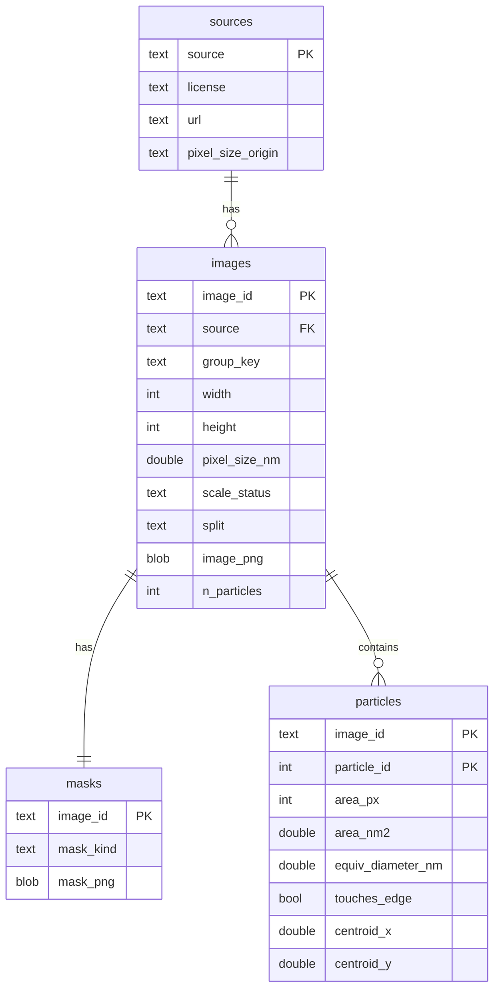
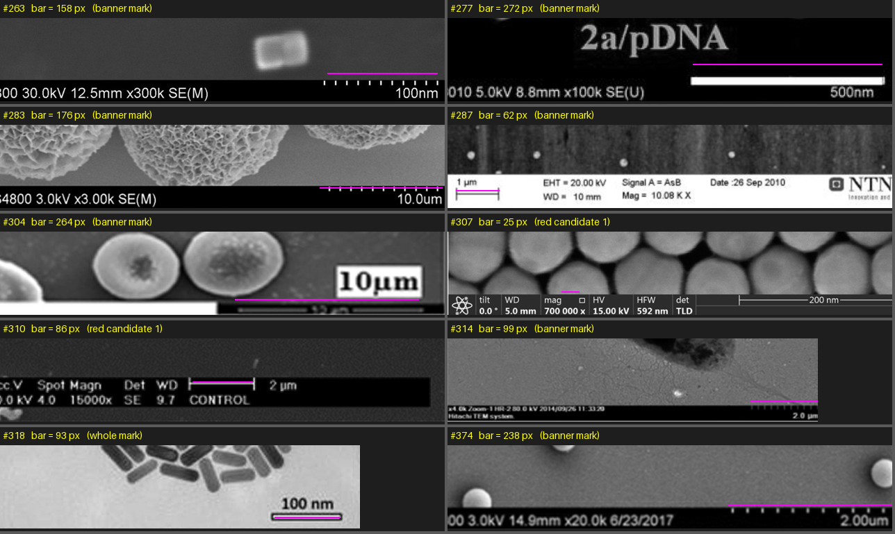
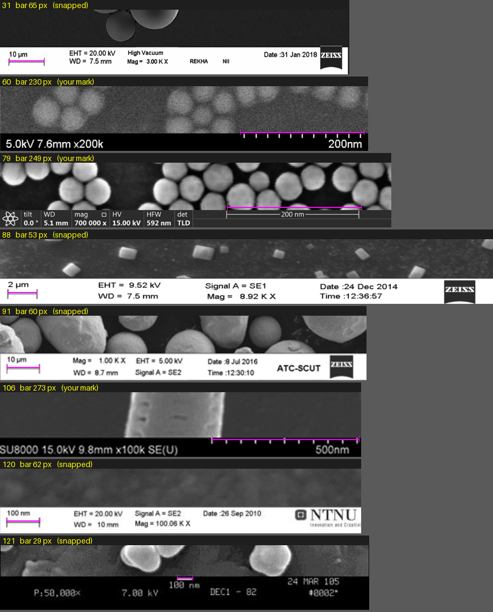
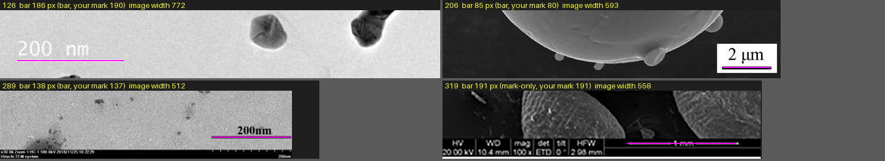
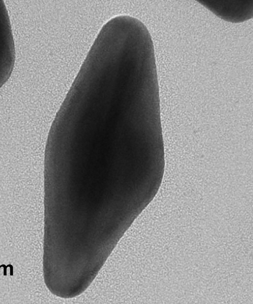
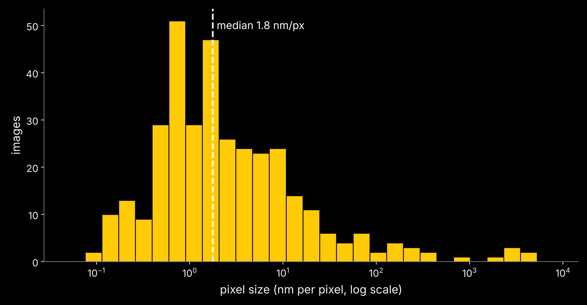

# emparticles — one database for EM nanoparticle segmentation

EMA 5937 *AI/ML for Materials Science*, Project A, **Part 1 (ETL)**. Author: Sakibul Islam Sazzad
(UCF, sakibsazzad[at]ucf[dot]edu).

```bash
git clone https://github.com/SakibulIslamSazzad/emparticles && cd emparticles && just
# or: tar xzvf emparticles.tar.gz && cd emparticles && just
```

`just` runs `Justfile → Containerfile → Makefile → src/emparticles/*.py → data/dataset.db`, then builds
the preliminary figures (`figures/*.png`) and `results/summary.json`. Without podman:
`uv sync && make all`. The default build downloads about 9 GB (see §3) and needs network access.

---

## 1. What this builds

Three EM nanoparticle datasets arrive in three different conventions. This repository turns them into
**one DuckDB file, `data/dataset.db`**, with one schema, one unit (nm per pixel), one train/eval split
and one table of particles. Everything downstream (figures, model training, leaderboard evaluation)
reads from that file only.

| source | images | what the raw data looks like | labels | pixel size |
|---|---|---|---|---|
| **EMPS** (github.com/by256/emps, MIT) | 465 literature TEM/SEM images, PNG | uint16 **instance** masks | instance ids | **burnt into the image** as a scale bar (see §4) |
| **HRTEM** (doi:10.7941/D1SP93, CC0) | raw OneView `.dm3`, 4096×4096 float32; 407 listed in the metadata | **binary** PNG labels (touching particles are merged) | binary | in the `.dm3` header |
| **Co3O4** (zenodo 14927582, CC BY 4.0) | 256 hand-labelled 512×512 images in HDF5 | one-hot float64, 2 channels | binary (channel 1 = particle) | **not in the files** (record says 67–86 pm/px) |

### Schema (`schema.sql`)



* `images.pixel_size_nm` is **nm per pixel for every source**. It is `NULL` when no scale exists, and
  `scale_status` says why: `ok` (EMPS, read from the burnt-in bar), `no_scale` (EMPS, none), `header`
  (HRTEM `.dm3`), `metadata_csv` (HRTEM fallback), `range_only` (Co3O4).
* `masks.mask_kind` is `instance` (EMPS ids) or `binary` (HRTEM, Co3O4; particles are the connected
  components, so **touching particles count as one**).
* `particles.touches_edge` flags particles cut off by the image border; size statistics exclude them.
* `images.split` is `train` or `eval`, assigned **by group** (`group_key`) with a seeded hash:
  EMPS by paper DOI, HRTEM by acquisition-session folder, Co3O4 one group per image (the files carry
  no acquisition information, so this is the weakest split — see *Limitations*).
* Pixels are lossless PNG BLOBs (uint16 for float sources; the original min/max are kept in
  `intensity_min/max`).

### Why these tools

* **DuckDB, a single file**: no server, SQL for the figures, BLOBs for pixels, and the whole database
  is one artifact to hash and compare. (I first tried Zarr + Parquet, then LanceDB; LanceDB crashed in
  the course VM, and two stores doubled the places where metadata and pixels could drift apart.)
* **Build to `dataset.db.tmp`, then rename**: an interrupted build never leaves a half-written database.
* **Idempotent and deterministic**: sorted inputs, deterministic ids, seeded hash splits. A second run of
  the EMPS part gave a byte-identical content hash.
* **Downloads cached in `data/raw`** (HRTEM/Co3O4 raw files are deleted after use, `keep_raw: false`).

---

## 2. How to run, configure

`config.yaml` controls everything: seed, eval fraction, per-source switches, the HRTEM subset size
(`limit`), downsampling (`downsample: 4`), and `keep_raw`. To change the subset edit `limit` (use `null`
for all 407 HRTEM images, about 26 GB of downloads).

```
make all        # data/dataset.db, figures/, results/summary.json
make clean
```

---

## 3. Sizes and the choices they forced

* HRTEM raw images are 4096×4096 float32 (65 MB each; 26 GB for all 407). I bin them by 4 to
  1024×1024 (block mean for the image, majority vote for the mask) and **multiply the pixel size by
  4**, so physical sizes stay correct. The default build uses a deterministic, hash-ordered subset of
  **100** images (`limit: 100`) so a fresh `just` run stays practical.
* Raw HRTEM and Co3O4 files are deleted right after they are processed, so peak disk use stays small.

---

## 4. EMPS: reading the scale bar by hand (and why)

EMPS has masks but **no pixel size**. Each picture carries a scale bar and a label ("200 nm", "2 µm")
burnt into the pixels. Without it, particle sizes cannot be compared in nanometres across images. Pixel
size spans about 0.09 to 5,200 nm/px, and the bars come in every style: black, white, grey; left or
right; plain rectangles, two-sided arrows, whisker rulers.



**Pixel size = printed value / bar length in pixels.** Both numbers have to be right.

### What did not work

Automatic detection was not reliable enough. Scored against my own marks on 30 banner images, the first
bar finder matched 3 of 30 and a thin-line finder 9 of 30; OCR of the labels was also too unreliable
(and a 1000× mix-up between nm and µm would silently ruin every size). I therefore used a
**human-in-the-loop** procedure:

1. A script proposes candidate bars (length in px) and draws them on review sheets.
2. I confirm correct ones, and mark the true bar **in green** on the sheet where the candidate is wrong
   (my hand-drawn marks are slightly slanted, so the script **snaps** each mark to the exact bar edges).
3. I read the printed value and unit from the tile itself.
4. A script (`annotations/emps_scale.csv`) stores `bar_px`, `scale_nm`, `pixel_size_nm` and a status.

Three passes covered all 465 images:

| pass | images | how |
|---|---:|---|
| Round 1 | 204 | detector line matched the bar; value read by eye |
| Excluded early | 50 | no scale bar or no readable value |
| Round 2, bottom strip | 101 | candidates reviewed, wrong ones re-marked |
| Round 2, banner | 40 | bars marked in green, snapped to pixels |
| Round 2, whole image | 70 | full-frame review; most have no bar |
| **total** | **465** | every image has a decision |



I cross-checked the extracted bars against the images tile by tile. On the bottom strips four bars had
to be corrected (images 126, 206, 289, 319):



### Edge cases I decided by hand

* **Image 212**: the label is cut off by the left edge (only the letter "m" survives), so there is no
  readable scale. It is flagged `no_scale`, not guessed.
  
* **Image 307**: the automatic candidate was a 25 px stub; the real "200 nm" bar runs tick to tick,
  242 px.
* **Image 376**: my table said 20 µm, the tile reads 2.0 µm. Units were re-checked on every tile.
* **Images without a bar** (many SEM pictures): kept, with `pixel_size_nm = NULL` and
  `scale_status = 'no_scale'`.
* **Instance ids** are not always consecutive (3 of 465 masks have gaps, from shapes fully covered or
  outside the image). Rule used everywhere: count the **unique non-zero ids**, never the maximum id.

**Result: 346 of 465 images have a pixel size (74%); 119 have none and keep a flag.** Median pixel size
1.8 nm/px.



The labels live in `annotations/emps_scale_labels.txt` (raw) and `annotations/emps_scale.csv`
(processed); both are committed so the table is reproducible without repeating the manual work.

---

## 5. HRTEM: from raw `.dm3` to particles

* The list of images comes from the dataset's `Dataset_metadata.csv`
  (`annotations/hrtem_metadata.csv`, columns `Folder` and `File name`). Files are fetched from the NERSC
  mirror as `<Folder>/<File name>`, labels from `<Folder>/Labels/<name>_label.png`. Folder names contain
  spaces and a sub-path, so URLs are escaped.
* **The same file name appears in different session folders; those are different acquisitions.** The
  image id is `hrtem:<Folder>/<name>`, never the bare name.
* Pixel size is read from the `.dm3` header with `ncempy` (`pixelSize`, `pixelUnit` = nm). It differs
  between images (different magnifications), which is why a single constant would have been wrong.
  After the 4× binning the values I saw were about 0.10 to 0.17 nm/px.
* Labels are binary: a blob of touching particles is one object, so **particle counts are lower bounds**
  and **sizes of touching particles are overestimates**.
* The split is by session folder: images from one session are near-duplicates.

---

## 6. Co3O4

* `training_images.h5` → `images` (256, 512, 512) float64; `training_labels.h5` → `labels`
  (256, 512, 512, 2) one-hot. The channel means were 0.72 / 0.28, and an overlay confirmed that
  **channel 1 is the particle** (red mask on the cubic crystals, background untouched).
* The files contain **no pixel size**. The Zenodo record gives only a range, 67–86 pm/px, so
  `pixel_size_nm` is `NULL` with `scale_status = 'range_only'` rather than an invented number.

---

## 7. Problems I ran into

| problem | what happened | what I did |
|---|---|---|
| EMPS has no pixel size | scale bars are burnt into the pixels | human-in-the-loop measurement (§4) |
| Automatic bar detection | 3/30 and 9/30 correct on banners; OCR unreliable | candidates + manual confirmation + snapping |
| nm vs µm | a 1000× error if misread | every value checked against its tile |
| Instance ids with gaps | max id ≠ number of particles | count unique non-zero ids |
| Binary masks | touching particles merge | `mask_kind = 'binary'`, documented as a lower bound |
| HRTEM names not unique | same file name, different session | id includes the session folder |
| HRTEM size | 65 MB per image | bin by 4, subset of 100, delete raw after use |
| Co3O4 pixel size | not in the files | stored as NULL + `range_only` |
| LanceDB | crashed in the VM | switched to DuckDB |
| VM instability | disk I/O errors and the virtual network dropping about every 20–30 minutes while downloading | downloads retry with backoff for ~35 minutes; raw files cleaned as I go; builds done right after a reboot |

---

## 8. Verification (what has and has not been checked)

Coding assistants (Claude) helped write the code; I verified it as follows.

* EMPS: full build, 465 images / 11,535 particles; a second run gave an identical content hash.
* HRTEM and Co3O4: small test builds on real downloads (3 and 5 images); an overlay of the Co3O4 mask
  on the image confirmed the label channel; HRTEM pixel sizes were compared with the header values.
* The full `just` run through podman is recorded in `results/summary.json` once it has been done on the
  target machine.

## 9. Limitations

* HRTEM and Co3O4 labels are binary, so particle counts and sizes of touching particles are biased.
* Co3O4 has no per-image pixel size and no group information (one group per image).
* The HRTEM default build is a subset and is binned by 4.
* 119 EMPS images have no usable scale and are `NULL` in nm columns.
